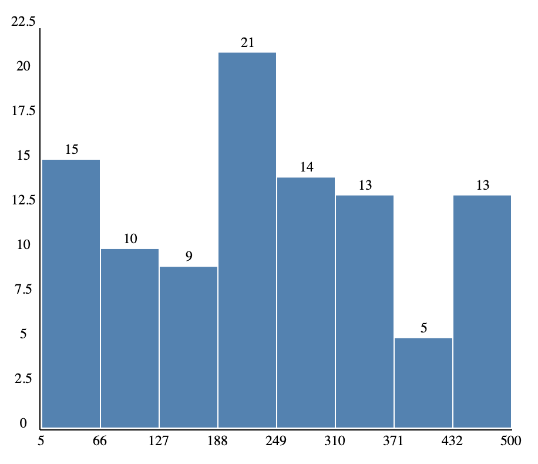

# js-visualization-practice

## 7.3-7.9学习记录

### 理论知识

#### JavaScript基本知识

- 参考资料：https://www.liaoxuefeng.com/wiki/1022910821149312/1023024977411904
- 进度：data type, function, object, 原型继承等

#### SVG

- 参考资料：https://developer.mozilla.org/en-US/docs/Web/SVG/Tutorial/Gradients
- 进度：目前到gradient，已学习basic shapes, fill & strokes, path & curves等

#### DOM

- 参考资料：https://developer.mozilla.org/en-US/docs/Web/API/Document/documentElement
- 进度：目前已学会用js创建和修改svg结点

#### D3 Library

- 重点学习了[d3-array](https://github.com/d3/d3-array/tree/v3.2.0)库，包括statistics和bin（即直方图处理）的源码，还有[Example](https://observablehq.com/@d3/d3-bin)
- 看了[d3-selection](https://github.com/d3/d3-selection/tree/v3.0.0)的API，帮助理解DOM

### 代码练习

这周主要在看理论知识，代码练习不多。只完成了简易的直方图(histogram)

- 生成均匀分布的样本数据以供测试
- 处理数据：data -> 8组bins（在写之前参考了d3-array-bin的源码）
- 用svg画图：包括矩形和坐标轴和数字刻度

此外还学习了如何用浏览器debug js代码

### 思考总结

- 本周花在学习js的时间较少
- 只看理论知识不动手实践效率较低。以svg为例，画直方图只需要学会`<rect>`和`<line>`即可，而我按照tutorial的进度学了很多其他知识再来画图
- 学习英文材料的速度较慢
- 不太懂得详略得当，js里知识太多了，学了一些不需要用到的内容

## 7.10-7.16学习记录

7.14

- 如何在外部js文件中引入d3库？`import`语句必须在`<script type="module">`中使用，单独的js文件会报错
