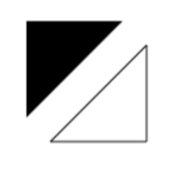

# Canvas

[TOC]

## Skeleton

```html
<!DOCTYPE html>
<html lang="en-US">
  <head>
    <meta charset="utf-8"/>
    <title>Canvas tutorial</title>
    <script>
      function draw() {
        const canvas = document.getElementById('tutorial');
        if (canvas.getContext) {
          const ctx = canvas.getContext('2d');
        }
      }
    </script>
    <style>
      canvas { border: 1px solid black; }
    </style>
  </head>
  <body onload="draw();">
    <canvas id="tutorial" width="150" height="150"></canvas>
  </body>
</html>
```

## Coordinates


Normally 1 unit in the grid corresponds to 1 pixel on the canvas.


## Rectangle

[`fillRect(x, y, width, height)`](https://developer.mozilla.org/en-US/docs/Web/API/CanvasRenderingContext2D/fillRect)

Draws a filled rectangle.

[`strokeRect(x, y, width, height)`](https://developer.mozilla.org/en-US/docs/Web/API/CanvasRenderingContext2D/strokeRect)

Draws a rectangular outline.

[`clearRect(x, y, width, height)`](https://developer.mozilla.org/en-US/docs/Web/API/CanvasRenderingContext2D/clearRect)

Clears the specified rectangular area, making it fully transparent.

`x` and `y` specify the position on the canvas (relative to the origin) of the top-left corner of the rectangle. `width` and `height` provide the rectangle's size.


## Path

[`beginPath()`](https://developer.mozilla.org/en-US/docs/Web/API/CanvasRenderingContext2D/beginPath)

Creates a new path. Once created, future drawing commands are directed into the path and used to build the path up.

[Path methods](https://developer.mozilla.org/en-US/docs/Web/API/CanvasRenderingContext2D#paths)

Methods to set different paths for objects.

[`closePath()`](https://developer.mozilla.org/en-US/docs/Web/API/CanvasRenderingContext2D/closePath)

Adds a straight line to the path, going to the start of the current sub-path.

[`stroke()`](https://developer.mozilla.org/en-US/docs/Web/API/CanvasRenderingContext2D/stroke)

Draws the shape by stroking its outline.

[`fill()`](https://developer.mozilla.org/en-US/docs/Web/API/CanvasRenderingContext2D/fill)

Draws a solid shape by filling the path's content area.


> **Note:** When the current path is empty, such as immediately after calling `beginPath()`, or on a newly created canvas, the first path construction command is always treated as a `moveTo()`, regardless of what it actually is. For that reason, **you will almost always want to specifically set your starting position after resetting a path.**
>
> **Note:** When you call `fill()`, any open shapes are closed automatically, so you don't have to call `closePath()`. This is **not** the case when you call `stroke()`.


### lineTo

```js
function draw() {
  const canvas = document.getElementById('canvas');
  if (canvas.getContext) {
    const ctx = canvas.getContext('2d');

    // Filled triangle
    ctx.beginPath();
    ctx.moveTo(25, 25);
    ctx.lineTo(105, 25);
    ctx.lineTo(25, 105);
    ctx.fill();

    // Stroked triangle
    ctx.beginPath();
    ctx.moveTo(125, 125);
    ctx.lineTo(125, 45);
    ctx.lineTo(45, 125);
    ctx.closePath();
    ctx.stroke();
  }
}
```




### Arcs

To draw arcs or circles, we use the `arc()` or `arcTo()` methods.

- [`arc(x, y, radius, startAngle, endAngle, counterclockwise)`](https://developer.mozilla.org/en-US/docs/Web/API/CanvasRenderingContext2D/arc)

  Draws an arc which is centered at *(x, y)* position with radius *r* starting at *startAngle* and ending at *endAngle* going in the given direction indicated by *counterclockwise* (defaulting to clockwise).

- [`arcTo(x1, y1, x2, y2, radius)`](https://developer.mozilla.org/en-US/docs/Web/API/CanvasRenderingContext2D/arcTo)

  Draws an arc with the given control points and radius, connected to the previous point by a straight line.

Let's have a more detailed look at the `arc` method, which takes six parameters: `x` and `y` are the coordinates of the center of the circle on which the arc should be drawn. `radius` is self-explanatory. The `startAngle` and `endAngle` parameters define the start and end points of the arc in radians, along the curve of the circle. These are measured from the x axis. The `counterclockwise` parameter is a Boolean value which, when `true`, draws the arc counterclockwise; otherwise, the arc is drawn clockwise.

> **Note:** Angles in the `arc` function are measured in radians, not degrees. To convert degrees to radians you can use the following JavaScript expression: `radians = (Math.PI/180)*degrees`.

```js
function draw() {
  const canvas = document.getElementById('canvas');
  if (canvas.getContext) {
    const ctx = canvas.getContext('2d');

    for (let i = 0; i < 4; i++) {
      for (let j = 0; j < 3; j++) {
        ctx.beginPath();
        const x = 25 + j * 50; // x coordinate
        const y = 25 + i * 50; // y coordinate
        const radius = 20; // Arc radius
        const startAngle = 0; // Starting point on circle
        const endAngle = Math.PI + (Math.PI * j) / 2; // End point on circle
        const counterclockwise = i % 2 !== 0; // clockwise or counterclockwise

        ctx.arc(x, y, radius, startAngle, endAngle, counterclockwise);

        if (i > 1) {
          ctx.fill();
        } else {
          ctx.stroke();
        }
      }
    }
  }
}
```


### [Bezier and quadratic curves](https://developer.mozilla.org/en-US/docs/Web/API/Canvas_API/Tutorial/Drawing_shapes#bezier_and_quadratic_curves)


## Path2D

```js
new Path2D();     // empty path object
new Path2D(path); // copy from another Path2D object
new Path2D(d);    // path from SVG path data
const p = new Path2D('M10 10 h 80 v 80 h -80 Z'); // copy from svg string
```

### Example

```js
function draw() {
  const canvas = document.getElementById('canvas');
  if (canvas.getContext) {
    const ctx = canvas.getContext('2d');

    const rectangle = new Path2D();
    rectangle.rect(10, 10, 50, 50);

    const circle = new Path2D();
    circle.arc(100, 35, 25, 0, 2 * Math.PI);

    ctx.stroke(rectangle);
    ctx.fill(circle);
  }
}
```


## Text

The canvas rendering context provides two methods to render text:

- [`fillText(text, x, y [, maxWidth\])`](https://developer.mozilla.org/en-US/docs/Web/API/CanvasRenderingContext2D/fillText)

  Fills a given text at the given (x,y) position. Optionally with a maximum width to draw.

- [`strokeText(text, x, y [, maxWidth\])`](https://developer.mozilla.org/en-US/docs/Web/API/CanvasRenderingContext2D/strokeText)

  Strokes a given text at the given (x,y) position. Optionally with a maximum width to draw.

### [A `fillText` example](https://developer.mozilla.org/en-US/docs/Web/API/Canvas_API/Tutorial/Drawing_text#a_filltext_example)

The text is filled using the current `fillStyle`.

```js
function draw() {
  const ctx = document.getElementById('canvas').getContext('2d');
  ctx.font = '48px serif';
  ctx.fillText('Hello world', 10, 50);
}
```

<iframe class="sample-code-frame" title="A fillText example sample" id="frame_a_filltext_example" width="310" height="110" src="https://yari-demos.prod.mdn.mozit.cloud/en-US/docs/Web/API/Canvas_API/Tutorial/Drawing_text/_sample_.a_filltext_example.html" loading="lazy" style="box-sizing: border-box; border: 1px solid var(--border-primary); max-width: 100%; width: 689.289px; background: rgb(255, 255, 255); border-radius: var(--elem-radius);"></iframe>

### [A `strokeText` example](https://developer.mozilla.org/en-US/docs/Web/API/Canvas_API/Tutorial/Drawing_text#a_stroketext_example)

The text is filled using the current `strokeStyle`.

```js
function draw() {
  const ctx = document.getElementById('canvas').getContext('2d');
  ctx.font = '48px serif';
  ctx.strokeText('Hello world', 10, 50);
}
```

<iframe class="sample-code-frame" title="A strokeText example sample" id="frame_a_stroketext_example" width="310" height="110" src="https://yari-demos.prod.mdn.mozit.cloud/en-US/docs/Web/API/Canvas_API/Tutorial/Drawing_text/_sample_.a_stroketext_example.html" loading="lazy" style="box-sizing: border-box; border: 1px solid var(--border-primary); max-width: 100%; width: 689.289px; background: rgb(255, 255, 255); border-radius: var(--elem-radius);"></iframe>

### [Styling text](https://developer.mozilla.org/en-US/docs/Web/API/Canvas_API/Tutorial/Drawing_text#styling_text)

In the examples above we are already making use of the `font` property to make the text a bit larger than the default size. There are some more properties which let you adjust the way the text gets displayed on the canvas:

- [`font = value`](https://developer.mozilla.org/en-US/docs/Web/API/CanvasRenderingContext2D/font)

  The current text style being used when drawing text. This string uses the same syntax as the [CSS](https://developer.mozilla.org/en-US/docs/Web/CSS) [`font`](https://developer.mozilla.org/en-US/docs/Web/CSS/font) property. The default font is 10px sans-serif.

- [`textAlign = value`](https://developer.mozilla.org/en-US/docs/Web/API/CanvasRenderingContext2D/textAlign)

  Text alignment setting. Possible values: `start`, `end`, `left`, `right` or `center`. The default value is `start`.

- [`textBaseline = value`](https://developer.mozilla.org/en-US/docs/Web/API/CanvasRenderingContext2D/textBaseline)

  Baseline alignment setting. Possible values: `top`, `hanging`, `middle`, `alphabetic`, `ideographic`, `bottom`. The default value is `alphabetic`.

- [`direction = value`](https://developer.mozilla.org/en-US/docs/Web/API/CanvasRenderingContext2D/direction)

  Directionality. Possible values: `ltr`, `rtl`, `inherit`. The default value is `inherit`.


