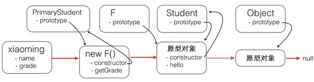

# OOP in JavaScript

> JavaScript不区分类和实例的概念，而是通过原型（prototype）来实现面向对象编程。

[TOC]

## `Object.create()`：创建空的对象

`Object.create()`方法可以传入一个原型对象，并创建一个基于该原型的新对象，但是新对象什么属性都没有，因此，我们可以编写一个函数来创建`xiaoming`：

```js
// 原型对象:
var Student = {
    name: 'Robot',
    height: 1.2,
    run: function () {
        console.log(this.name + ' is running...');
    }
};

function createStudent(name) {
    // 基于Student原型创建一个新对象:
    var s = Object.create(Student);
    // 初始化新对象:
    s.name = name;
    return s;
}

var xiaoming = createStudent('小明');
xiaoming.run(); // 小明 is running...
xiaoming.__proto__ === Student; // true
```


## 原型继承

> JavaScript的原型链和Java的Class区别就在，它没有“Class”的概念，所有对象都是实例，所谓继承关系不过是把一个对象的原型指向另一个对象而已。

### 原型链

JavaScript对每个创建的对象都会设置一个原型，指向它的原型对象。

当我们用`obj.xxx`访问一个对象的属性时，JavaScript引擎先在当前对象上查找该属性，如果没有找到，就到其原型对象上找，如果还没有找到，就一直上溯到`Object.prototype`对象，最后，如果还没有找到，就只能返回`undefined`。

例如，创建一个`Array`对象：

```js
var arr = [1, 2, 3];
```

其原型链是：

```js
arr ----> Array.prototype ----> Object.prototype ----> null
```

`Array.prototype`定义了`indexOf()`、`shift()`等方法，因此你可以在所有的`Array`对象上直接调用这些方法。

当我们创建一个函数时：

```js
function foo() {
    return 0;
}
```

函数也是一个对象，它的原型链是：

```js
foo ----> Function.prototype ----> Object.prototype ----> null
```

由于`Function.prototype`定义了`apply()`等方法，因此，所有函数都可以调用`apply()`方法。

> 注：对象有`_proto_`属性，（构造）函数有`prototype`属性。在编写JavaScript代码时，不要直接用`obj.__proto__`去改变一个对象的原型。


### `new Student()`：构造函数

除了直接用`{ ... }`创建一个对象外，JavaScript还可以用一种构造函数的方法来创建对象。它的用法是，先定义一个构造函数：

```js
function Student(name) {
    this.name = name;
    this.hello = function () {
        alert('Hello, ' + this.name + '!');
    }
}
```

在JavaScript中，可以用**关键字`new`来调用这个函数**，并返回一个对象：

```js
var xiaoming = new Student('小明');
xiaoming.name; // '小明'
xiaoming.hello(); // Hello, 小明!
```

*注意*，如果不写`new`，这就是一个普通函数，它返回`undefined`。但是，如果写了`new`，它就变成了一个构造函数，它绑定的`this`指向新创建的对象，并默认返回`this`，也就是说，不需要在最后写`return this;`。

新创建的`xiaoming`的原型链是：

```js
xiaoming ----> Student.prototype ----> Object.prototype ----> null
```


红色箭头是原型链。注意，`Student.prototype`指向的对象就是`xiaoming`、`xiaohong`的原型对象，这个原型对象自己还有个属性`constructor`，指向`Student`函数本身。

另外，函数`Student`恰好有个属性`prototype`指向`xiaoming`、`xiaohong`的原型对象，但是`xiaoming`、`xiaohong`这些对象可没有`prototype`这个属性，不过可以用`__proto__`这个非标准用法来查看。

现在我们就认为`xiaoming`、`xiaohong`这些对象“继承”自`Student`。


### 将公共方法放入`Student.prototype`中

不过还有一个小问题，注意观察：

```js
xiaoming.name; // '小明'
xiaohong.name; // '小红'
xiaoming.hello; // function: Student.hello()
xiaohong.hello; // function: Student.hello()
xiaoming.hello === xiaohong.hello; // false
```

`xiaoming`和`xiaohong`各自的`name`不同，这是对的，否则我们无法区分谁是谁了。

`xiaoming`和`xiaohong`各自的`hello`是一个函数，但它们是两个不同的函数，虽然函数名称和代码都是相同的！

如果我们通过`new Student()`创建了很多对象，这些对象的`hello`函数实际上只需要共享同一个函数就可以了，这样可以节省很多内存。

要让创建的对象共享一个`hello`函数，根据对象的属性查找原则，我们只要把`hello`函数移动到`xiaoming`、`xiaohong`这些对象共同的原型上就可以了，也就是`Student.prototype`：

修改代码如下：

```js
function Student(name) {
    this.name = name;
}

Student.prototype.hello = function () {
    alert('Hello, ' + this.name + '!');
};
```


### 常用的编程模式

最后，我们还可以编写一个`createStudent()`函数，在内部封装所有的`new`操作。一个常用的编程模式像这样：

```js
function Student(props) {
    this.name = props.name || '匿名'; // 默认值为'匿名'
    this.grade = props.grade || 1; // 默认值为1
}

Student.prototype.hello = function () {
    alert('Hello, ' + this.name + '!');
};

function createStudent(props) {
    return new Student(props || {})
}
```

这个`createStudent()`函数有几个巨大的优点：一是不需要`new`来调用，二是参数非常灵活，可以不传，也可以这么传：

```js
var xiaoming = createStudent({
    name: '小明'
});

xiaoming.grade; // 1
```

如果创建的对象有很多属性，我们只需要传递需要的某些属性，剩下的属性可以用默认值。由于参数是一个Object，我们无需记忆参数的顺序。如果恰好从`JSON`拿到了一个对象，就可以直接创建出`xiaoming`。





### 链式继承

如果把继承这个动作用一个`inherits()`函数封装起来，还可以隐藏`F`的定义，并简化代码：

```js
function inherits(Child, Parent) {
    var F = function () {};
    F.prototype = Parent.prototype;
    Child.prototype = new F();
    Child.prototype.constructor = Child;
}
```

这个`inherits()`函数可以复用：

```js
function Student(props) {
    this.name = props.name || 'Unnamed';
}

Student.prototype.hello = function () {
    alert('Hello, ' + this.name + '!');
}

function PrimaryStudent(props) {
    Student.call(this, props);
    this.grade = props.grade || 1;
}

// 实现原型继承链:
inherits(PrimaryStudent, Student);

// 绑定其他方法到PrimaryStudent原型:
PrimaryStudent.prototype.getGrade = function () {
    return this.grade;
};
```

#### 小结

JavaScript的原型继承实现方式就是：

1. 定义新的构造函数，并在内部用`call()`调用希望“继承”的构造函数，并绑定`this`；
2. 借助中间函数`F`实现原型链继承，最好通过封装的`inherits`函数完成；
3. 继续在新的构造函数的原型上定义新方法。


## `class`：原型继承的语法糖

如果用新的`class`关键字来编写`Student`，可以这样写：

```js
class Student {
    constructor(name) {
        this.name = name;
    }

    hello() {
        alert('Hello, ' + this.name + '!');
    }
}
```

用`class`定义对象的另一个巨大的好处是继承更方便了。想一想我们从`Student`派生一个`PrimaryStudent`需要编写的代码量。现在，原型继承的中间对象，原型对象的构造函数等等都不需要考虑了，直接通过`extends`来实现：

```js
class PrimaryStudent extends Student {
    constructor(name, grade) {
        super(name); // 记得用super调用父类的构造方法!
        this.grade = grade;
    }

    myGrade() {
        alert('I am at grade ' + this.grade);
    }
}
```

注意`PrimaryStudent`的定义也是class关键字实现的，而`extends`则表示原型链对象来自`Student`。子类的构造函数可能会与父类不太相同，例如，`PrimaryStudent`需要`name`和`grade`两个参数，并且需要通过`super(name)`来调用父类的构造函数，否则父类的`name`属性无法正常初始化。