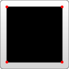
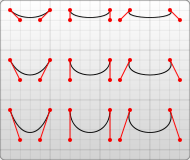

# SVG

[TOC]

A simple SVG document consists of nothing more than the `<svg>` root element and several basic shapes that build a graphic together. In addition there is the `<g>` element, which is used to group several basic shapes together.


- SVG elements and attributes should all be entered in the case shown here since XML is case-sensitive (unlike HTML).
- Attribute values in SVG must be placed inside quotes(`width="100"`), even if they are numbers.


```html
<circle cx="150" cy="100" r="80" fill="green" />
```

(center of circle offset 150px to the right, and 100px downward from the top left corner).


the order of rendering elements. The globally valid rule for SVG files is, that *later* elements are rendered *atop previous* elements.


## Positions

### Coordinates

以左上角为原点


### Units

- Default setting: 1 user pixel = 1 device pixel(而1像素 = ? cm 则由机器决定 )

  ```html
  <svg 
        width="200" height="200" 
        xmlns="http://www.w3.org/2000/svg">
  
    <rect x="0" y="0" width="100" height="100" />
  ```

- **user coordinate system**:可以人为设置比例尺，如以下设置`ViewBox`属性可以使得1 user pixel = 2 device pixels

  ```html
  <svg version="1.1"
        width="200" height="200" viewBox="0 0 100 100"
        xmlns="http://www.w3.org/2000/svg">
  
    <rect x="0" y="0" width="100" height="100" />
  
  </svg>
  ```

  

The default user coordinate system maps one user pixel to one device pixel.


## Basic shapes


### Rectangle

```html
<rect x="10" y="10" width="30" height="30"/>
<rect x="60" y="10" rx="10" ry="10" width="30" height="30"/>
```

- x: The x position of the top left corner of the rectangle.
- y: The y position of the top left corner of the rectangle.
- rx: The x radius of the corners of the rectangle.


### Circle

```html
<circle cx="25" cy="75" r="20"/>
```

- r: The radius of the circle.

- cx: The x position of the center of the circle.


### Ellipse

```html
<ellipse cx="75" cy="75" rx="20" ry="5"/>
```

- rx: The x radius of the ellipse.（半长轴）

- ry: The y radius of the ellipse.（半短轴）


### Line

```html
<line x1="10" x2="50" y1="110" y2="150" stroke="black" stroke-width="5"/>
```


### Polyline

> 折线

```html
<polyline points="60, 110 65, 120 70, 115 75, 130 80, 125 85, 140 90, 135 95, 150 100, 145"/>
```

- points: 一组点集，由空格、逗号或者EOL分割。the list `(0,0)`, `(1,1)`, and `(2,2)` would be written as `0, 0 1, 1 2, 2`.


### Polygon

> 多边形

A `<polygon>` is similar to a `<polyline>`, in that it is composed of straight line segments connecting a list of points. For polygons though, the path automatically connects the last point with the first, creating a closed shape.

```html
<polygon points="50, 160 55, 180 70, 180 60, 190 65, 205 50, 195 35, 205 40, 190 30, 180 45, 180"/>
```

- points: the list `(0,0)`, `(1,1)`, and `(2,2)` would be written as `0, 0 1, 1 2, 2`. The drawing then closes the path, so a final straight line would be drawn from (2,2) to (0,0).


## Path

to move to (`10`,`10`) the command to use would be `M 10 10`.

An **uppercase letter** specifies absolute coordinates on the page, and a **lowercase letter** specifies relative coordinates (e.g., *move 10px up and 7px to the left from the last point*).

Coordinates in the `d` parameter are **always unitless** and hence in the user coordinate system.

### Line Commands

#### Move To

```c
M x y
(or)
m dx dy
```

- 移动画笔到某处（绝对位置(x,y)或者相对当前位置(x0+dx, y0+dy)）
  - 不画出线条，相当于笔抬起
  - 常用于指定初始位置

#### Line to

```
 L x y
 (or)
 l dx dy
```

`L` takes two parameters—x and y coordinates—and draws a line from the current position to a new position.

There are two abbreviated forms for drawing horizontal and vertical lines. `H` draws a horizontal line, and `V` draws a vertical line. Both commands only take one parameter since they only move in one direction.

```
 H x
 (or)
 h dx

 V y
 (or)
 v dy
```



```html
<svg width="100" height="100" xmlns="http://www.w3.org/2000/svg">

  <path d="M 10 10 H 90 V 90 H 10 L 10 10"/>

  <!-- Points -->
  <circle cx="10" cy="10" r="2" fill="red"/>
  <circle cx="90" cy="90" r="2" fill="red"/>
  <circle cx="90" cy="10" r="2" fill="red"/>
  <circle cx="10" cy="90" r="2" fill="red"/>

</svg>
```


#### Close Path

`Z` command draws a straight line from the current position back to the first point of the path. It is often placed at the end of a path node, although not always. There is no difference between the uppercase and lowercase command.

```
 Z
 (or)
 z
```

```html
 <path d="M 10 10 H 90 V 90 H 10 Z" fill="transparent" stroke="black"/>
```

Relative Version:

```html
 <path d="M 10 10 h 80 v 80 h -80 Z" fill="transparent" stroke="black"/>
```


### Curve Commands

#### `C`: 三次贝塞尔曲线(Bezier Curves)

> 关于贝塞尔曲线的介绍：
>
> - 一二三四阶贝塞尔曲线的可视化：https://www.jasondavies.com/animated-bezier/
> - 贝塞尔曲线公式和性质：https://www.zhihu.com/question/29565629



```
 M x0 y0
 C x1 y1, x2 y2, x y
 (or)
 c dx1 dy1, dx2 dy2, dx dy
```

`(x0,y0)`是曲线的起点，`(x,y)`是曲线终点。

`(x1,y1)`和`(x2, y2)`是两个控制点


```html
<svg width="190" height="160" xmlns="http://www.w3.org/2000/svg">

  <path d="M 10 10 C 20 20, 40 20, 50 10" stroke="black" fill="transparent"/>
  <path d="M 70 10 C 70 20, 110 20, 110 10" stroke="black" fill="transparent"/>
  <path d="M 130 10 C 120 20, 180 20, 170 10" stroke="black" fill="transparent"/>
  <path d="M 10 60 C 20 80, 40 80, 50 60" stroke="black" fill="transparent"/>
  <path d="M 70 60 C 70 80, 110 80, 110 60" stroke="black" fill="transparent"/>
  <path d="M 130 60 C 120 80, 180 80, 170 60" stroke="black" fill="transparent"/>
  <path d="M 10 110 C 20 140, 40 140, 50 110" stroke="black" fill="transparent"/>
  <path d="M 70 110 C 70 140, 110 140, 110 110" stroke="black" fill="transparent"/>
  <path d="M 130 110 C 120 140, 180 140, 170 110" stroke="black" fill="transparent"/>

</svg>
```


#### `S`: 镜像对称的三次贝塞尔曲线

```
 S x2 y2, x y
 (or)
 s dx2 dy2, dx dy
```

- `(x2,y2)`是连线上的控制点

- `(x,y)`是镜像曲线的终点


```html
<svg width="190" height="160" xmlns="http://www.w3.org/2000/svg">
  <path d="M 10 80 C 40 10, 65 10, 95 80 S 150 150, 180 80" stroke="black" fill="transparent"/>
</svg>
```


#### `Q`: 二次贝塞尔曲线

```
 Q x1 y1, x y
 (or)
 q dx1 dy1, dx dy
```


```html
<svg width="190" height="160" xmlns="http://www.w3.org/2000/svg">
  <path d="M 10 80 Q 95 10 180 80" stroke="black" fill="transparent"/>
</svg>
```


#### `T`: 镜像的二次贝塞尔曲线

```
 T x y
 (or)
 t dx dy
```


```html
<svg width="190" height="160" xmlns="http://www.w3.org/2000/svg">
  <path d="M 10 80 Q 52.5 10, 95 80 T 180 80" stroke="black" fill="transparent"/>
</svg>
```


#### `A`: Arcs

Arcs are sections of circles or ellipses.

==To be continue...==

https://developer.mozilla.org/en-US/docs/Web/SVG/Tutorial/Paths#arcs


## Fills and Strokes

### Color

```html
 <rect x="10" y="10" width="100" height="100" stroke="blue" fill="purple"
       fill-opacity="0.5" stroke-opacity="0.8"/>
```

- `fill` sets the color inside the object 
- `stroke` sets the color of the line drawn around the object
  - color names (that is `red`), rgb values (that is `rgb(255,0,0)`), hex values, rgba values
- `fill-opacity` and `stroke-opacity` attributes: 不透明度


### Width & Shape


```html
<?xml version="1.0" standalone="no"?>
<svg width="160" height="140" xmlns="http://www.w3.org/2000/svg" version="1.1">
  <line x1="40" x2="120" y1="20" y2="20" stroke="black" stroke-width="20" stroke-linecap="butt"/>
  <line x1="40" x2="120" y1="60" y2="60" stroke="black" stroke-width="20" stroke-linecap="square"/>
  <line x1="40" x2="120" y1="100" y2="100" stroke="black" stroke-width="20" stroke-linecap="round"/>
</svg>
```

- `stroke-width` property defines the width of this stroke
- `stroke-linecap` property, demonstrated above. This controls the shape of the ends of lines.
  - `butt` closes the line off with a straight edge that's normal (at 90 degrees) to the direction of the stroke and crosses its end.
  - `square` has essentially the same appearance, but stretches the stroke slightly beyond the actual path. The distance that the stroke goes beyond the path is half the `stroke-width`.
  - `round` produces a rounded effect on the end of the stroke. The radius of this curve is also controlled by the `stroke-width`.


```html
<?xml version="1.0" standalone="no"?>
<svg width="160" height="280" xmlns="http://www.w3.org/2000/svg" version="1.1">
  <polyline points="40 60 80 20 120 60" stroke="black" stroke-width="20"
      stroke-linecap="butt" fill="none" stroke-linejoin="miter"/>

  <polyline points="40 140 80 100 120 140" stroke="black" stroke-width="20"
      stroke-linecap="round" fill="none" stroke-linejoin="round"/>

  <polyline points="40 220 80 180 120 220" stroke="black" stroke-width="20"
      stroke-linecap="square" fill="none" stroke-linejoin="bevel"/>
</svg>
```

- `stroke-linejoin` to control how the joint between two line segments is drawn.
  - `miter` extends the line slightly beyond its normal width to create a square corner where only one angle is used. 
  - `round` creates a rounded line segment. 
  - `bevel` creates a new angle to aid in the transition between the two segments.


<svg width="200" height="150" xmlns="http://www.w3.org/2000/svg" version="1.1">
  <path d="M 10 75 Q 50 10 100 75 T 190 75" stroke="black"
    stroke-linecap="round" stroke-dasharray="5,10,5" fill="none"/>
  <path d="M 10 75 L 190 75" stroke="red"
    stroke-linecap="round" stroke-width="1" stroke-dasharray="5,5" fill="none"/>
</svg>

```html
<?xml version="1.0" standalone="no"?>
<svg width="200" height="150" xmlns="http://www.w3.org/2000/svg" version="1.1">
  <path d="M 10 75 Q 50 10 100 75 T 190 75" stroke="black"
    stroke-linecap="round" stroke-dasharray="5,10,5" fill="none"/>
  <path d="M 10 75 L 190 75" stroke="red"
    stroke-linecap="round" stroke-width="1" stroke-dasharray="5,5" fill="none"/>
</svg>
```

The `stroke-dasharray` attribute takes a series of comma-separated numbers as its argument.


### Using CSS

#### style arrtibute

```html
 <rect x="10" height="180" y="10" width="180" style="stroke: black; fill: red;"/>
```


#### `<defs>` embedded in `<svg>`

```html
<?xml version="1.0" standalone="no"?>
<svg width="200" height="200" xmlns="http://www.w3.org/2000/svg" version="1.1">
  <defs>
    <style type="text/css"><![CDATA[
       #MyRect {
         stroke: black;
         fill: red;
       }
    ]]></style>
  </defs>
  <rect x="10" height="180" y="10" width="180" id="MyRect"/>
</svg>
```


#### `.css` file

Where `style.css` looks something like:

```css
#MyRect {
  fill: red;
  stroke: black;
}
```


## Gradients

- 适用对象：fills or strokes
- 两种类型：linear and radial
- 使用方法：
  - You **must** give the gradient an `id` attribute
  - defined in a defs section as opposed to on a shape itself to promote reusability.

### Linear Gradients


```html
<svg width="120" height="240" version="1.1" xmlns="http://www.w3.org/2000/svg">
  <defs>
      <linearGradient id="Gradient1">
        <stop class="stop1" offset="0%"/>
        <stop class="stop2" offset="50%"/>
        <stop class="stop3" offset="100%"/>
      </linearGradient>
      <linearGradient id="Gradient2" x1="0" x2="0" y1="0" y2="1">
        <stop offset="0%" stop-color="red"/>
        <stop offset="50%" stop-color="black" stop-opacity="0"/>
        <stop offset="100%" stop-color="blue"/>
      </linearGradient>
      <style type="text/css"><![CDATA[
        #rect1 { fill: url(#Gradient1); }
        .stop1 { stop-color: red; }
        .stop2 { stop-color: black; stop-opacity: 0; }
        .stop3 { stop-color: blue; }
      ]]></style>
  </defs>

  <rect id="rect1" x="10" y="10" rx="15" ry="15" width="100" height="100"/>
  <rect x="10" y="120" rx="15" ry="15" width="100" height="100" fill="url(#Gradient2)"/>

</svg>
```

- `<stop>` nodes tell the gradient what color it should be at certain positions by specifying an `offset` attribute for the position, and a `stop-color` attribute. You can specify a `stop-opacity` attribute to set the opacity at that position.
  - the offsets should always increase from 0% (or 0 if you want to drop the % sign) to 100% (or 1).
- To use a gradient, set the `fill` to `url(#Gradient)`
- The orientation of the gradient is controlled by two points, designated by the attributes `x1`, `x2`, `y1`, and `y2`. These attributes define a line along which the gradient travels(直线的方向向量). The gradient defaults to a horizontal orientation, but it can be rotated by changing these.


```html
<linearGradient id="Gradient1">
  <stop id="stop1" offset="0%"/>
  <stop id="stop2" offset="50%"/>
  <stop id="stop3" offset="100%"/>
</linearGradient>
<linearGradient id="Gradient2" x1="0" x2="0" y1="0" y2="1"
   xmlns:xlink="http://www.w3.org/1999/xlink" xlink:href="#Gradient1"/>
```

**Note:** You can also use the `xlink:href` attribute on gradients too. When it is used, attributes and stops from one gradient can be included on another. In the above example, you wouldn't have to recreate all the stops in Gradient2.


## Text

### Basics

```html
<text x="10" y="10">Hello World!</text>
```

- The `x` and `y` attributes determine, where in the viewport the text will appear. 
- The attribute `text-anchor`, which can have the values "start", "middle", "end" or "inherit", decides in which direction the text flows from this point. 
- The attribute `dominant-baseline` decides the vertical alignment.
- colorized with the `fill` attribute and given a stroke with the `stroke` attribute. 

`font-family`, `font-style`, `font-weight`, `font-variant`, `font-stretch`, `font-size`, `font-size-adjust`, `kerning`, `letter-spacing`, `word-spacing` and `text-decoration`.